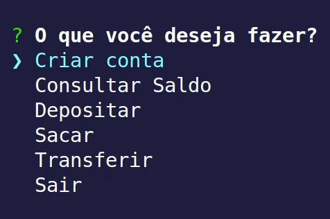

<h1>node cash machine</h1>

<br/>

### Tópicos

:small_blue_diamond: [Descrição do projeto](#descrição-do-projeto)

:small_blue_diamond: [Pré-requisitos](#pré-requisitos)

:small_blue_diamond: [Como rodar a aplicação](#como-rodar-a-aplicação-arrow_forward)

<br/>

## Descrição do projeto



<p align="justify">
  Um simulador de sistema de caixa eletrônico bancário feito em Javascript com Node.js.
</p>

<br/>

## Pré-requisitos

:warning: Node.js 

:warning: Npm

<br/>

## Como rodar a aplicação :arrow_forward:

No terminal, clone o projeto:

```
git clone https://github.com/hudsonsamuelsantos/node-cash-machine.git
```
Acesse a pasta raiz do repositório clonado e rode:

```
npm install
```


Em outro terminal, rode:

```
npm start
```

## Autor :octocat:

Hudson Santos

https://www.linkedin.com/in/hudsonsamuelsantos
